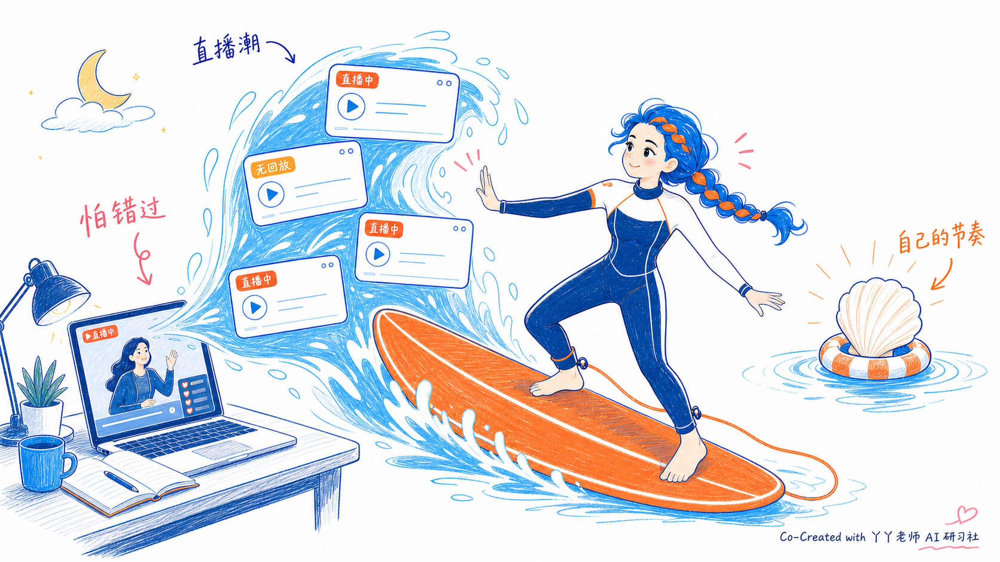
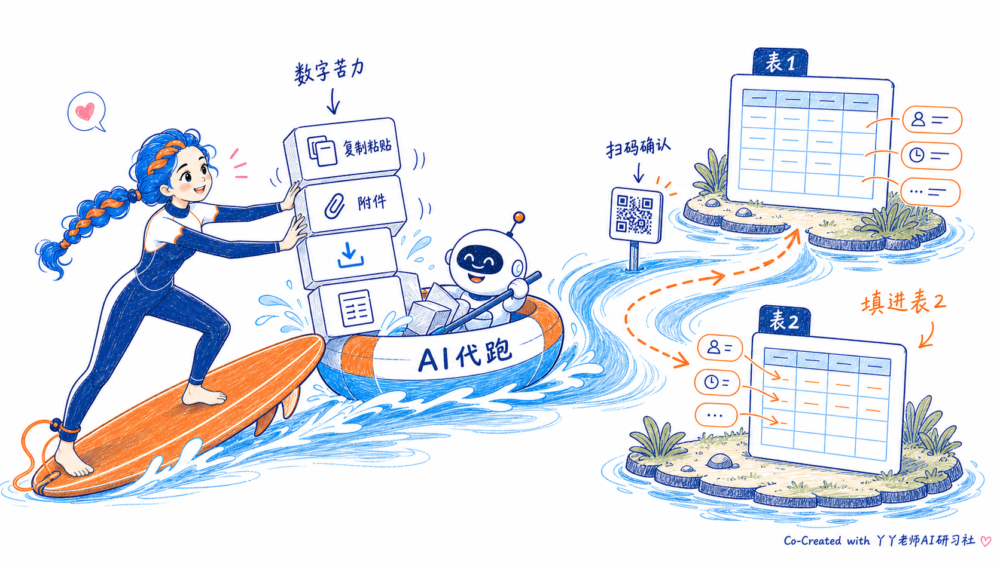
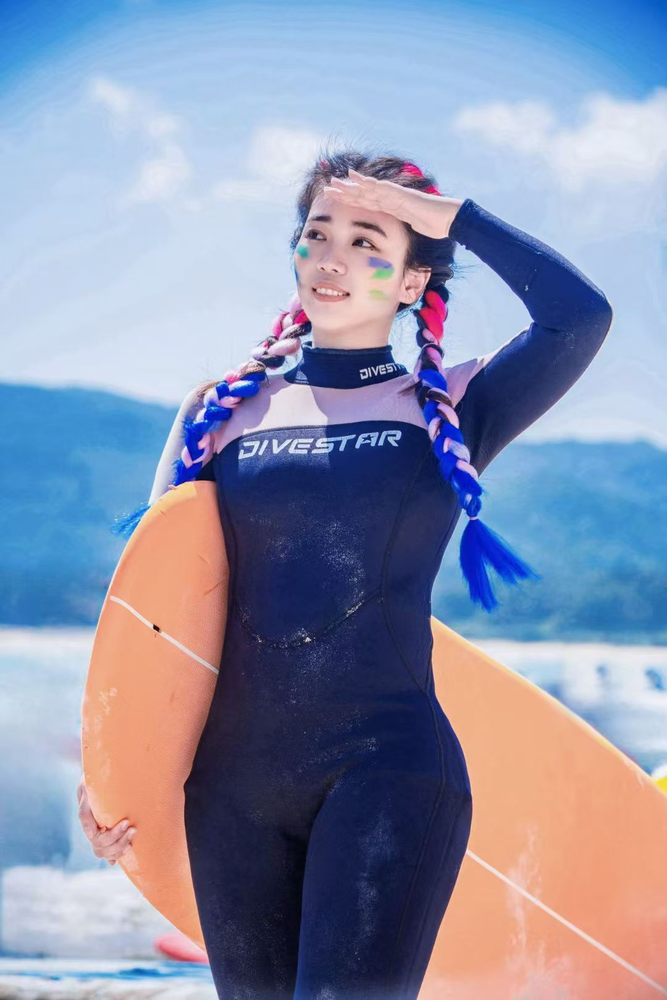
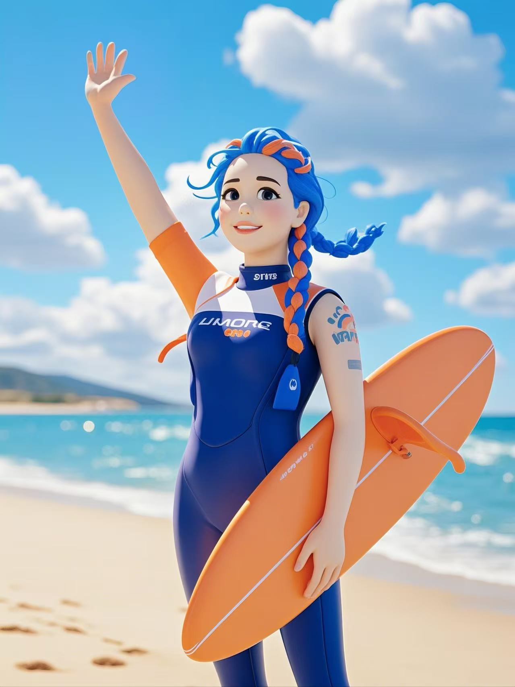

# 丫丫海风手绘正文配图 Skill

> 不是“给文章配张图”，而是把你的个人审美、角色 IP、独特色板和内容理解方式，封装成一套会工作的正文配图系统。

`yaya-surf-illustrations` 是一个 Codex Skill，用来为中文文章、笔记、课程稿、方法论内容生成正文配图。它不是通用头像 prompt，也不是海边海报模板，而是一套可复用的个人品牌视觉资产：用丫丫的蓝发冲浪女孩 IP，把抽象判断、流程、状态和隐喻画成一张张轻盈、清楚、有记忆点的手绘图。

## 一眼看懂：从真人照片到品牌正文配图

先看最终效果。这两张不是为了做海报，而是为了证明：同一个个人形象、同一组主题色、同一套隐喻逻辑，可以被稳定地嵌进不同文章里，变成有角色、有动作、有记忆点的正文配图。

<p>
  
  
</p>

它的起点不是一句 prompt，而是一张真实照片。先把真实照片转成动漫 IP，再提取主题色、角色规则和隐喻系统，最后让 Skill 根据具体文章生成正文图。

| 1. 真实照片 | 2. 动漫 IP | 3. 测试图：怕错过 | 4. 测试图：AI 代跑 |
| --- | --- | --- | --- |
|  |  |  |  |

完整路径是：

```text
真实照片 -> 动漫 IP -> 主题色提取 -> 风格边界 -> 隐喻系统 -> 正文配图 Skill -> 真实文章测试
```

一开始，我先选了一张自己喜欢的真实冲浪照片：蓝天、海边、冲浪服、橙色冲浪板、彩色辫子。这张图里已经有很强的个人识别度。

然后把它转成动漫 IP：保留冲浪女孩、蓝发、橙色冲浪板、海风场景这些关键记忆点，让它从“照片”变成一个可以反复出现在内容里的角色。

接着从动漫图里提取主题色：天空蓝、深海蓝、冲浪橙、柔粉、云朵白。

最后，才把这些东西封装进 Codex Skill：角色是谁、颜色怎么用、哪些风格不要、每张图怎么从文字里抓“认知动作”、生成后怎么检查。

## 为什么做这个

很多内容不是缺“好看配图”，而是缺一个能帮读者停下来理解的视觉锚点。

普通配图通常只做气氛：科技感、学习感、职场感、海边感。

这套 Skill 要做的是更深一层：把文章里真正有价值的那一下“认知动作”画出来。

比如：

- 不是“我在学习”，而是“我怕错过，所以被直播潮推着走”。
- 不是“AI 很厉害”，而是“我终于把复制、下载、上传、填表这些数字苦力交给 AI 代跑”。
- 不是“个人品牌要好看”，而是“我的照片、配色、角色、隐喻和表达逻辑，可以长期稳定地长在一起”。

## 整个逻辑

### 1. 先找“认知动作”

每张图只画一个核心动作，不平均给每段都配图。

常见的认知动作包括：

- 从混乱到清楚
- 从被节奏推着走到拿回自己的节奏
- 从信息噪音里捞出真问题
- 从分散素材走向一个承接路径
- 从焦虑选择变成可判断的筛选
- 从抽象信任变成一块块证据

### 2. 再换成海风隐喻

抽象概念会被翻译成可以画出来的海边动作：

- 信息过载：直播潮、浪、浮卡片
- 承接路径：冲浪板桥、岸线、绳索
- 筛选判断：潮水分流、贝壳分类、浮标
- 深度理解：潜入水下捞出真正的问题
- 质量检查：灯塔、浮标、潮汐线
- 拿回节奏：贝壳、浮标、稳定的板面
- 自动化代跑：AI 小船、水路、表格小岛、任务箱

这样图会有解释力，但不会变成 PPT 流程图。

### 3. 角色必须参与核心动作

丫丫不是贴纸，也不是头像。她必须承担画面的关键动作：

- 用冲浪板挡住信息潮
- 把散落的想法捞回来
- 把数字苦力交给 AI 小船
- 在两座岛之间架起冲浪板桥
- 沿着浪线标出路线
- 从水下带回一个真问题
- 把证据贝壳一颗颗铺成路径

判断标准很简单：如果把丫丫删掉，图仍然完全成立，说明角色太装饰，需要重画。

### 4. 固定成个人品牌资产

视觉资产保持稳定，方便长期积累识别度：

- 蓝发冲浪女孩 IP
- 一个马尾辫/单条辫子，不是双马尾、双辫或两侧对称发束
- 橙色冲浪板
- 深蓝白色冲浪服
- 白底、留白、轻手绘线条
- 蓝 / 粉 / 橙 / 白主题色
- 少量中文手写批注
- 底角小字署名：`Co-Created with 丫丫老师AI研习社`

主题色：

- 天空蓝：`#48B0E0` / `#60B8E8`
- 深海蓝：`#003080` / `#0B2F7A`
- 冲浪橙：`#E08850` / `#F07A2A`
- 柔粉：`#F4A7B8` / `#F8C7D2`
- 云朵白：`#FFFFFF` / `#F8F8F0`

## 两个真实测试案例

这两张案例图在前面已经出现过一次，这里再放一次，是为了拆解它们背后的生成逻辑：测试文字是什么，Skill 抓到了什么认知动作，又是怎么把它翻译成画面的。

### 示例 01：我不是没时间学习，我是怕错过


测试文字见：[examples/01-fomo-livestream.md](yaya-surf-illustrations/examples/01-fomo-livestream.md)

测试文字讲的是：打开 AI 公开课，本来想认真听、认真记，但直播太多，有的没回放、有的像干货、有的像卖课。你不看怕错过，看了又怕被节奏推着走。

Skill 抓到的不是“学习”，而是这一下认知动作：

```text
不是没时间学习，而是怕错过。
```

所以图里没有画一个普通的“认真学习的人”，而是把直播信息画成从电脑里涌出来的蓝色潮水，把公开课卡片画成浪里的浮卡。丫丫不是站着摆拍，而是踩着橙色冲浪板，伸手挡住信息潮，右侧用贝壳代表“自己的节奏”。

生成重点：

- 抽象情绪：怕错过
- 物理隐喻：直播潮
- 角色动作：丫丫用冲浪板减速
- 视觉锚点：无回放、直播中、自己的节奏
- 品牌规则：蓝粉橙白、单条辫子、底角署名

### 示例 02：AI 终于开始替我干数字苦力了


测试文字见：[examples/02-ai-digital-labor.md](yaya-surf-illustrations/examples/02-ai-digital-labor.md)

测试文字讲的是：以前复制粘贴、下载附件、上传填写都默认只能自己干；这次把两个表格链接给 AI，它会看字段、提示扫码、继续操作，把第一个表的信息填进第二个表。

Skill 抓到的不是“AI 很酷”，而是这一下认知动作：

```text
把重复、繁琐、低判断含量的数字苦力交给 AI 代跑。
```

所以图里没有画一个泛泛的机器人，而是把复制、附件、下载、填表变成一叠“任务箱”。丫丫把任务箱推给 AI 小船，小船沿着水路把字段从表 1 搬到表 2，人类只在“扫码确认”这个节点轻轻介入。

生成重点：

- 抽象判断：数字苦力该交给 AI
- 物理隐喻：AI 小船代跑
- 角色动作：丫丫把任务箱交出去
- 视觉锚点：表 1、表 2、扫码确认、填进表 2
- 品牌规则：蓝粉橙白、单条辫子、底角署名

## 如果你也想做自己的个人品牌配图 Skill

这件事最有意思的地方，不是“复制丫丫的蓝橙冲浪风”，而是把你自己的东西固定下来。

你也可以从一张最像自己的照片开始。它可以是工作照、生活照、旅行照、运动照，也可以是你某个长期使用的头像。关键是：这张图里要有“别人一看就想到你”的线索。

然后把它变成一套可以反复使用的品牌资产：

- 你的角色是谁：真人、头像、吉祥物、抽象符号，还是某个长期出现的动作主体？
- 你的主题色是什么：从照片或动漫图里提取，不要只说“高级”“温暖”，要落到 3-5 个稳定色值。
- 你的内容经常在讲什么：学习、AI、商业、教育、成长、生活方式，还是别的？
- 你的隐喻系统是什么：海浪、厨房、山路、实验室、园艺、积木、地图、剧场？
- 你的图要帮读者完成什么：理解结构、感受情绪、看见路径、做出判断，还是记住一个观点？

如果你不知道怎么做，可以直接把下面这段给 Codex：

```text
我想做一套自己的个人品牌正文配图 Skill。
请先帮我从这张图片中识别我的角色形象、主题色、常见内容主题和适合我的隐喻系统；
然后把它整理成一个 Codex Skill：
1. 每张图只表达一个认知动作；
2. 角色必须参与核心动作；
3. 固定我的品牌色和风格边界；
4. 给出 prompt template、composition patterns 和 QA checklist；
5. 最后帮我用两段真实文字测试这套工作流。
```

这个 Skill 的作用，就是把这些散落的审美和方法收进一个可复用工作流里。以后你不是每次重新解释“我要什么风格”，而是让 Skill 引导模型进入你的品牌画法。

说得更直白一点：你不是在做一套图，你是在给自己的内容装一个“视觉人格”。

## 风格边界

要：

- 白底手绘
- 轻线条
- 平涂色块
- 大量留白
- 解释一个认知动作
- 中文标注短而少

不要：

- 油画质感
- glossy 3D
- 玩偶/粘土 avatar 感
- 海边写真海报
- 密密麻麻的 PPT 信息图
- 大段中文解释塞进图里
- 角色只是摆拍
- 把发型画成双马尾或双辫
- 忘记底角署名

## 安装

把 skill 文件夹复制到 Codex skills 目录：

```bash
mkdir -p "${CODEX_HOME:-$HOME/.codex}/skills"
cp -R ./yaya-surf-illustrations "${CODEX_HOME:-$HOME/.codex}/skills/"
```

安装后重启 Codex。

## 使用方式

只做配图规划：

```text
Use $yaya-surf-illustrations 先不要生图。
请为下面这篇中文文章设计 5 张正文配图 shot list。
```

直接生成配图：

```text
Use $yaya-surf-illustrations 为这篇中文文章设计并生成 4 张海风手绘正文配图。
```

单个概念出图：

```text
Use $yaya-surf-illustrations 为“我不是没时间学习，我是怕错过”生成一张正文配图。
```

## 目录结构

```text
yaya-surf-illustrations/
├── SKILL.md
├── agents/
│   └── openai.yaml
├── assets/
│   ├── character-reference.png
│   ├── origin/
│   │   ├── anime-surf-ip.jpg
│   │   └── real-surf-photo.jpg
│   └── examples/
│       ├── 01-fomo-livestream.png
│       ├── 02-ai-digital-labor.png
│       └── README.md
├── examples/
│   ├── 01-fomo-livestream.md
│   └── 02-ai-digital-labor.md
└── references/
    ├── brand-dna.md
    ├── character-ip.md
    ├── composition-patterns.md
    ├── prompt-template.md
    └── qa-checklist.md
```

## 说明

这个仓库包含个人品牌资产。除非之后补充 License 文件，否则默认不授予开源复用授权。
